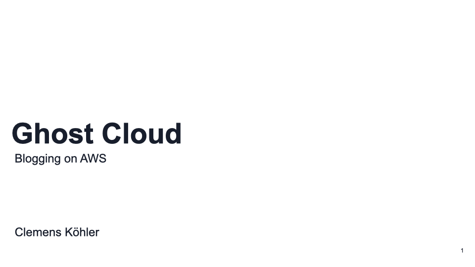
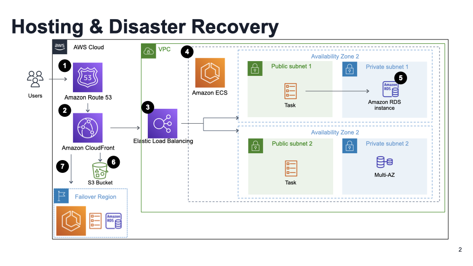
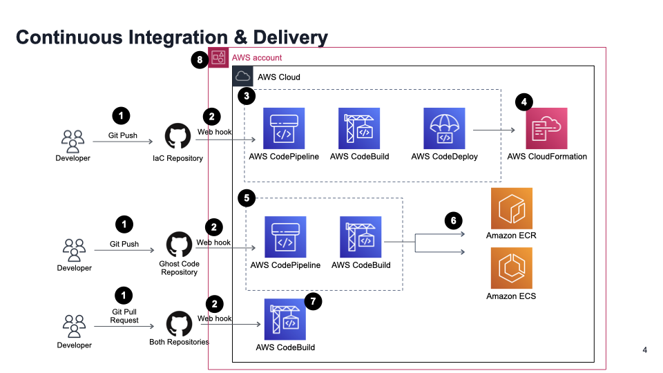
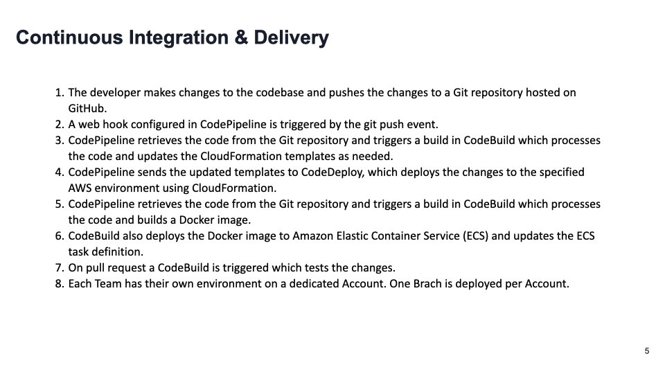

# Ghost in the Cloud ☁️ 

Welcome to the Ghost in the Cloud project, a project to host the Ghost platform in the cloud. Below you find instructions for installation and a summary of the project's architecture as well as slides. 

## 💻 Installation
To get this project up and running on your own machine, follow these steps:

1. Fork https://github.com/KoehlerClem/ghost_platform and https://github.com/KoehlerClem/Ghost
2. Initialize the submodules in the Ghost Repository:

        git submodule update --init --recursive

3. Create a GitHub token with these permissions:

4. Run the deploy script with the following arguments:

        ./deploy.sh <aws-profile> <GitHubOwner> <ghost-aws-infra-repo> <ghost-repo> <git-branch> <github-token>
        
    for example: 
        
        ./deploy.sh default KoehlerClem ghost_platform Ghost main abc123SecretToken

    Only one branch per AWS account is supported. If you want to deploy multiple branches, you need to create a new AWS account for each branch.

5. ☕️ Wait for about 30 minutes for the deployment to complete.
6. In the AWS console go to the CloudFormation stack and look for the CloudFront output link. 
7. Gost is now deployed and ready to use under the CloudFront URL!

## Updating the Ghost App

To update the Ghost app, simply push your changes to the Ghost GitHub repository. The Codepipeline will automatically detect the changes and deploy the new version of the Ghost app.

## Updating the AWS Infrastructure

To update the AWS infrastructure, simply push your changes to the ghost_platform GitHub repository. The Codepipeline will automatically detect the changes and deploy the new version of the AWS infrastructure.

### Use Delete Posts Lambda

Create a integration for the Posts Lambda in the Ghost admin panel:

How To: https://ghost.org/docs/admin-api/#token-authentication

1. Go to the Ghost admin panel and go to Settings

2. Go to Integrations

3. Click on "Add custom integration"

4. Enter the name of the integration and Get the Admin API Key

Got to ghost-blog-Lambda and create a test:

    { 
        "ghost_Admin_API_key": "YOUR_ADMIN_API_KEY_HERE" 
    }

Click Test to run the Lambda function.

## 🛠️ Update the Codepipeline

To update the Codepipelines set the AWS profile:
    
    export aws_profile=<aws-profile>

Updating the AWS Infrastructure as Code Pipeline:

    aws cloudformation deploy --template-file CICD/codepipeline_infra.yml --stack-name codepipeline-infra --capabilities CAPABILITY_IAM --profile $aws_profile

Updating the Ghost App Codepipeline:

    aws cloudformation deploy --template-file CICD/codepipeline_app.yml --stack-name codepipeline-app --capabilities CAPABILITY_IAM --profile $aws_profile

## 📝 Architecture Summary

In the Ghost in the Cloud project, the Ghost platform is hosted in the cloud using the following architecture:

- The Ghost app is connected to a MySQL RDS database, which has a multi-AZ deployment for high availability.
- The Ghost app is a Node.js app running on an ECS cluster behind a load balancer.
- The Ghost app load balancer is behind a CloudFront deployment for improved performance and scalability.
- Different environments for teams are divided into separate AWS accounts, and a continuous integration pipeline is in place for both the Infrastructure as Code (IAS) and the Ghost app.

To ensure security and monitoring in the Ghost in the Cloud project, the following best practices have been implemented:

- Identity and Access Management (IAM) policies are used to control access to the ECS cluster, RDS database, and other resources and services.
- CloudTrail is enabled to log API calls made to the ECS cluster, RDS database, and other resources and services.
- Security groups and network ACLs are implemented to control inbound and outbound traffic to the ECS cluster, RDS database, and other resources and services.
- Amazon CloudWatch is used to monitor resource usage and alert on any thresholds being exceeded.

Additional security and monitoring best practices that could be implemented in the future include:

- AWS PrivateLink to securely connect resources and services over a private network connection.
- AWS Config to continuously monitor resource configurations and alert on any changes.
- Amazon GuardDuty to continuously monitor for malicious or unauthorized activity.

Overall, this architecture allows the Ghost platform to be hosted in the cloud with high availability, performance, and scalability. It also allows teams to work independently in their own environments while still ensuring that changes are seamlessly integrated and deployed. Security and monitoring best practices have also been implemented to ensure the security and stability of the Ghost platform in the cloud.

While the Ghost platform is hosted in the cloud, [the Ghost platform itself is not cloud-native](https://ghost.org/docs/faq/clustering-sharding-multi-server/). This means that the Ghost platform is not optimized for the cloud and does not take advantage of the cloud's scalability and elasticity. If the CDN is not enough to handle the traffic, we should consider scaling the database or Ghost platform vertically by increasing the CPU and memory of the task definition.

## 📚 Architecture Slides

